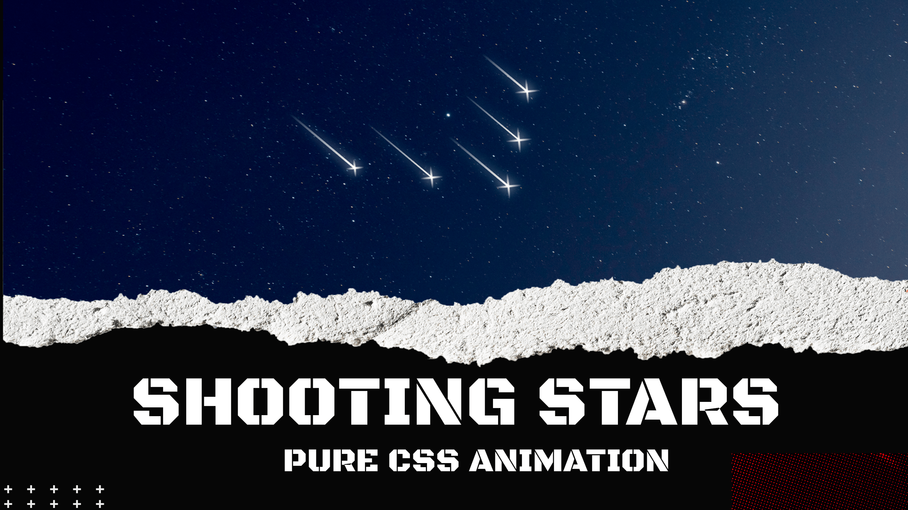

# Shooting Star Animation Effect | Pure CSS | HTML CSS

The shooting star animation effect implemented using pure CSS and HTML is a visually captivating technique that adds an element of dynamism and charm to a webpage. This effect creates the illusion of a shooting star streaking across the screen, leaving a trail of light in its wake. Leveraging keyframe animations and CSS properties such as @keyframes, animation, and transform, this effect allows developers to simulate the movement of a shooting star, giving the impression of motion and speed. By combining these CSS animations with HTML elements, developers can design a visually appealing and immersive experience for website visitors. The shooting star animation effect is commonly used to enhance the visual storytelling and engagement of a webpage, creating a memorable and enchanting user experience. By incorporating this effect, web developers can add an element of whimsy and delight, making the website more visually appealing and leaving a lasting impression on users.

